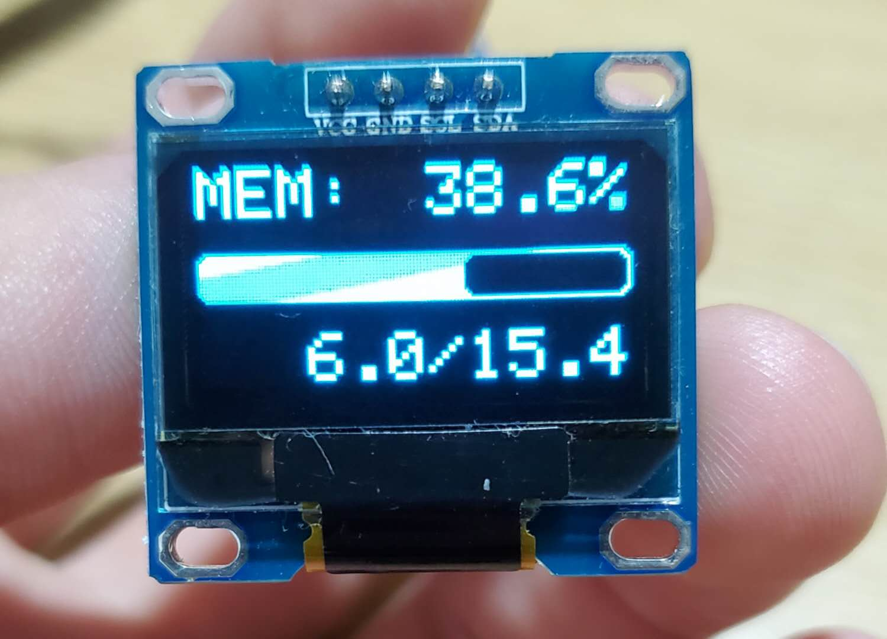

外置性能监视器
====

NodeJS + Arduino + OLED 可以嵌入机箱的性能监视器



### 环境依赖
- NodeJS: v12.16.1
- NPM: 6.14.5
- Arduino IDE
  - Adafruit_SSD1306
  - Adafruit-GFX-Library

### 使用方式

1. 连接Arduino与OLED模块，连接当时参考`Adafruit_SSD1306`文档
2. 使用Arduino IDE下载`client`程序到Arduino
3. 使用`npm`全局安装`external-monitor`
    ```
    npm install --global external-monitor
    ```
4. 启动`external-monitor`服务
    ```
    external-monitor start
    ```

**如果无法使用串口请检查用户是否在`dialout`用户组。**
